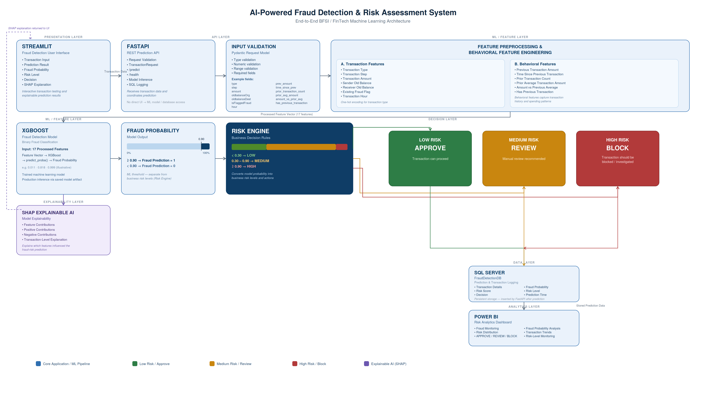

## 📊 Live Prediction Results

The system was tested with three different transaction-risk scenarios through the Streamlit interface.

### 🟢 Low-Risk Transaction

The model identified the transaction as low risk and recommended approval.

**Result:** LOW → APPROVE

---

### 🟡 Medium-Risk Transaction

The model identified elevated fraud probability and recommended manual review.

**Result:** MEDIUM → REVIEW

---

### 🔴 High-Risk Transaction

The model identified a very high fraud probability and recommended blocking the transaction.

**Result:** HIGH → BLOCK

## 🏗️ System Architecture

The system follows an end-to-end machine learning architecture connecting the user interface, REST API, feature engineering pipeline, XGBoost model, risk engine, SQL Server database, explainable AI, and Power BI analytics.

## 📈 Model Performance

The production XGBoost model was evaluated on a held-out test set of **200,000 transactions**, including **258 confirmed fraudulent transactions**. The evaluation uses the same **0.90 decision threshold** deployed in the production application.

| Metric    |     Score |
| --------- | --------: |
| Precision | **76.0%** |
| Recall    | **86.0%** |
| F1-Score  | **80.7%** |
| PR-AUC    | **89.6%** |

### Confusion Matrix

|                       | Predicted Legitimate | Predicted Fraud |
| --------------------- | -------------------: | --------------: |
| **Actual Legitimate** |              199,672 |              70 |
| **Actual Fraud**      |                   36 |             222 |

### Key Results

* **222 of 258 fraudulent transactions detected**, achieving **86.0% recall**.
* Only **36 fraudulent transactions were missed** by the model.
* **70 legitimate transactions were incorrectly flagged**, resulting in a false-positive rate of approximately **0.035%**.
* **PR-AUC of 89.6%** demonstrates strong fraud-detection performance despite the extreme class imbalance in the dataset.
* The **0.90 production threshold** was selected to prioritize fraud detection while keeping false-positive rates manageable.

### Why These Metrics Matter

* **Recall:** Critical in fraud detection because missing a fraudulent transaction can be significantly more costly than investigating a false alarm.
* **Precision:** Measures how many transactions flagged as fraud were actually fraudulent, helping control unnecessary manual investigations.
* **F1-Score:** Provides a balance between precision and recall and is useful for comparing different classification thresholds.
* **PR-AUC:** Particularly useful for highly imbalanced fraud datasets because it focuses on the model's ability to identify the minority fraud class.

